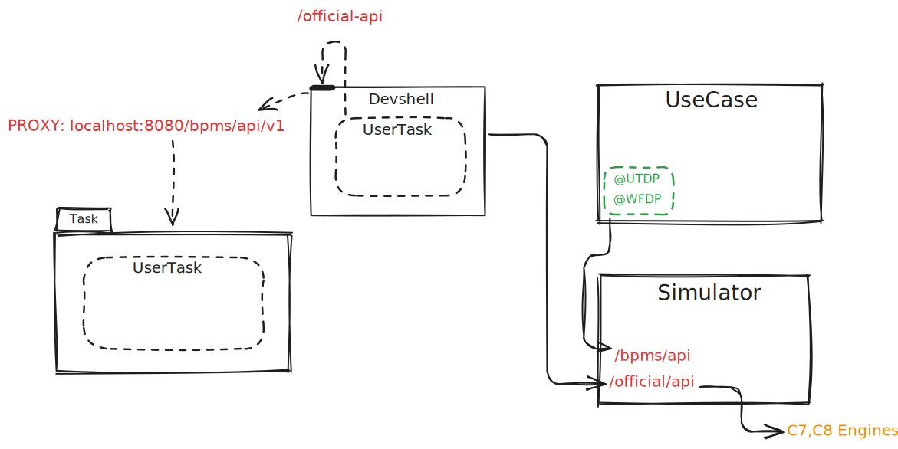

# **Dev-Shell Simulator**

## **Overview**

The **dev-shell-simulator** is a tool designed to provide data for the **dev-shell**, a simplified replication of the **Business Cockpit**. The dev-shell allows developers to interact with **Camunda processes** and **UserTasks** through a UI.

The main purpose of the simulator is to **populate the dev-shell with test data**, enabling smooth development with **hot module replacement** for instant updates.

## **How It Works**

### **Communication Flow**

1. The **Camunda Business Cockpit** application is started.
2. A **UserTask is initialized**, triggering an event.
3. The `` annotation forwards task details to the **BPMS API (**``**)**, which is handled by the **simulator**.
4. The **dev-shell** retrieves task data from the **Official API (**``**)**, which either:
   - Fetches UserTasks from **Camunda 7 (C7)** or **Camunda 8 (C8)**.
   - Retrieves stored events directly from the simulator.



## **Project Structure**


### 1. (`BpmsApiController`)

- Handles **UserTask creation and updates**.
- Receives events and **stores them in the TaskService**.
- Manages **Workflow events** through the **WorkflowService**.
- **Relevant Methods:**
  - `userTaskCreatedEvent(event)` → Creates a new UserTask.
  - `userTaskUpdatedEvent(userTaskId, event)` → Updates an existing UserTask.
  - `workflowCreatedEvent(event)` → Creates a new Workflow.
  - `workflowUpdatedEvent(workflowId, event)` → Updates a Workflow.

### 2.(`OfficialApiTaskController`)

- Provides an API for retrieving **UserTasks**.
- Fetches task data from the **TaskService**.
- **Relevant Method:**
  - `getUserTask(userTaskId, markAsRead)` → Returns a UserTask by ID.

### 3.(`OfficialApiWorkflowController`)

- Retrieves Workflow data from the **WorkflowService**.
- **Relevant Method:**
  - `getWorkflow(workflowId)` → Returns a Workflow by ID.

### 4. (`TaskService`)

- Manages all **UserTask operations**.
- Stores tasks in a **local HashMap**.
- **Relevant Methods:**
  - `createTask(taskId, event)` → Creates a new task with event details.
  - `getUserTask(userTaskId)` → Retrieves a UserTask.
  - `updateTask(userTaskId, details)` → Updates task details.

### 5. (`TaskService`)

- Manages **Workflows** similar to UserTasks.
- **Relevant Methods:**
  - `createWorkflow(workflowId, event)` → Creates a new Workflow.
  - `getWorkflow(workflowId)` → Retrieves a Workflow.
  - `updateWorkflow(workflowId, details)` → Updates Workflow details.

## **Setup & Running the Dev-Shell Simulator**

### **1. Prerequisites**

- **Java 17+**
- **Maven**
- **Camunda Business Cockpit** (Standalone)

### **2. Build and Run**

```sh
mvn clean package
java -jar target/dev-shell-simulator-0.0.4-SNAPSHOT.jar
```

### **3. API Endpoints**

| API              | Endpoint                                          | Description          |
| ---------------- | ------------------------------------------------- | -------------------- |
| **BPMS API**     | `POST /bpms/api/v1/usertask/created`              | Creates a UserTask   |
| **BPMS API**     | `POST /bpms/api/v1/usertask/{userTaskId}/updated` | Updates a UserTask   |
| **BPMS API**     | `POST /bpms/api/v1/workflow/created`              | Creates a Workflow   |
| **Official API** | `GET /official-api/v1/usertask/{userTaskId}`      | Retrieves a UserTask |
| **Official API** | `GET /official-api/v1/workflow/{workflowId}`      | Retrieves a Workflow |

---

## **Why Use the Dev-Shell Simulator?**

✔ **Quick Development:** Hot module replacement ensures instant updates.\
✔ **Camunda Process Testing:** Simulate UserTasks and Workflows without requiring a full Camunda instance.\
✔ **Separation of Concerns:** The simulator provides data, while the dev-shell handles UI interactions.

## Noteworthy & Contributors

VanillaBP was developed by [Phactum](https://www.phactum.at) with the intention of giving back to the community as it
has benefited the community in the past.\


## License

Copyright 2025 Phactum Softwareentwicklung GmbH

Licensed under the Apache License, Version 2.0

